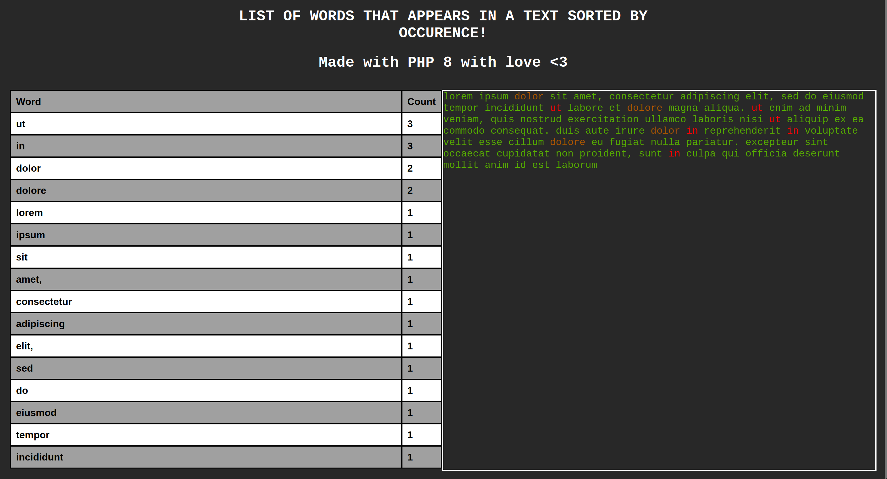

# PHPSUCKS
My first experience with PHP. I have to say that the memes are wrong, PHP is a nice language.

Analyze a file and get a report with the number of occurence of every word.

## USAGE
Compile your page using the Makefile provided:
- With the files you want:
```bash
$ make FILENAME= $file_path
```
- Or with the provided lorem ipsum
```bash
$ make
```

- You can also use php directly, but remember to provide a valid file:
```bash
$ php index.php $file_path > index.html
```

## 

